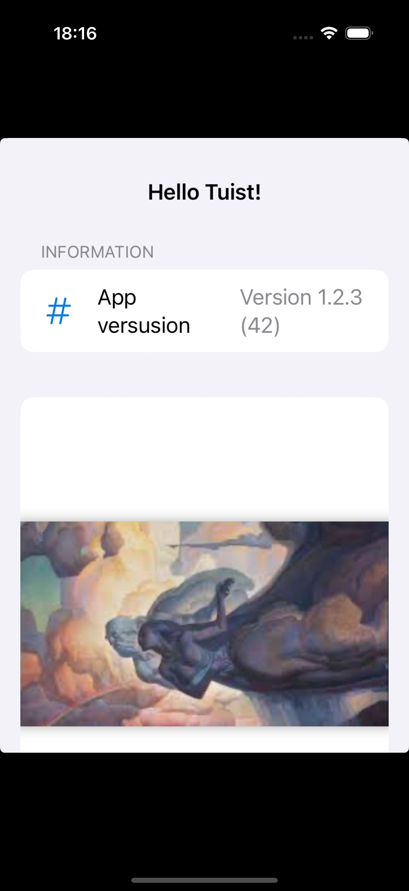

Sample iOS project built with Tuist

# HelloTuist
Sample iOS project built with Tuist. This is the basecode for following post [Alternative to .xcodeproj Chaos: Intro to Tuist for iOS Newbies](https://javios.eu/xcode/alternative-to-xcodeproj-chaos-intro-to-tuist-for-ios-newbies/)

## iOs App Review

## Requirements

- **Xcode 15.0 or later**
- **iOS 16.0 or later**
